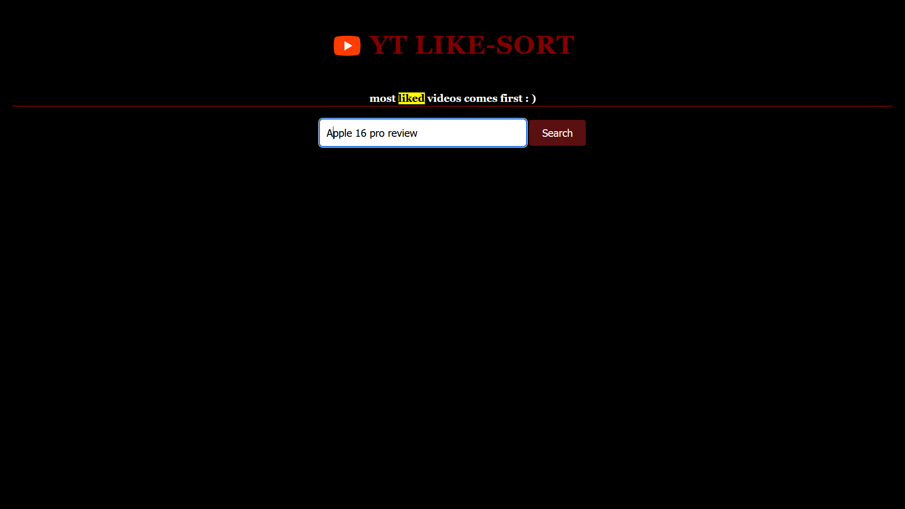
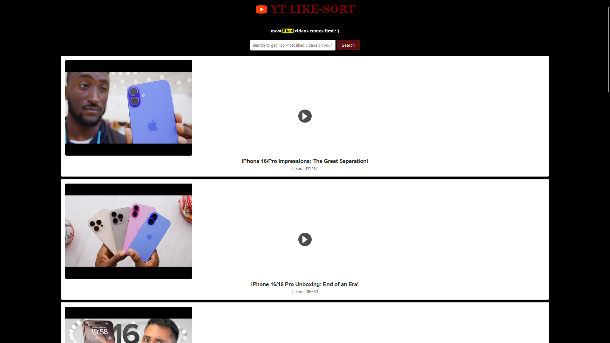
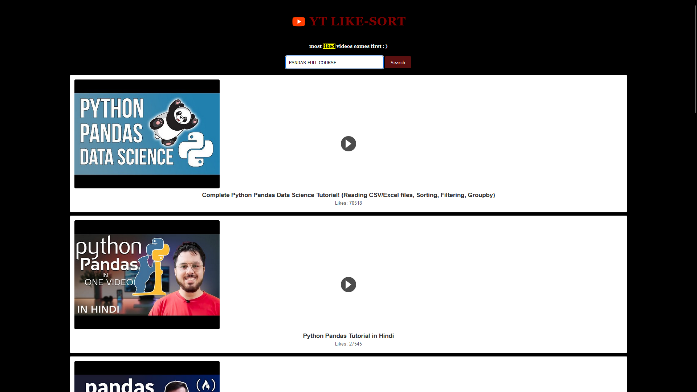
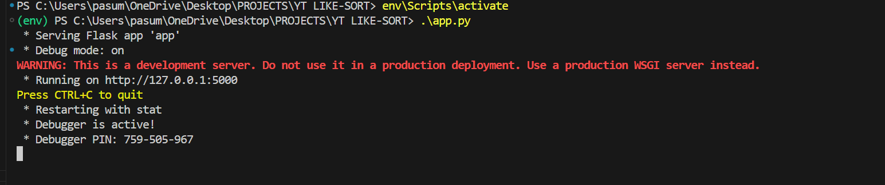

##   YT LIKE-SORT 
 LIKE-SORT is a web-based application that allows users to search for YouTube videos on any topic and displays the top results sorted by the number of likes. This project utilizes the YouTube Data API to fetch video details and provides an easy-to-use interface for accessing the most liked videos.
## Demo

<a href="https://www.youtube.com/watch?v=YOUR_VIDEO_ID_HERE">
    
    <h4>CLICK ON 👆🏻 YOUTUBE LOGO TO 👀 WATCH DEMO 📽️</h4>
</a>

## Project Aim
The aim of YT LIKE-SORT is to provide a platform where users can easily find the most appreciated YouTube videos on a given topic. This ensures high-quality content discovery based on community feedback in the form of likes.

## Real World Scenario
- Users can search for popular tutorials or reviews on any topic.
- YT LIKE-SORT sorts videos based on the number of likes, showing the most liked first.
- It helps users quickly find high-quality, community-approved content.
- The sorting approach ensures valuable resources are easily discoverable.


## Key Features
- **Search YouTube Videos:** Users can search for videos on any topic and receive a list of relevant results.
- **Like-based Sorting:** Results are sorted based on the number of likes, with the most liked videos appearing first.
- **Responsive Design:** The user interface is designed to work seamlessly across different devices.
- **Video Thumbnails and Titles:** Displays video thumbnails and titles, along with a link to watch the video on YouTube.

## Technologies Used


- **Python (Flask):** Backend server and API integration.
- **YouTube Data API:** Fetching video information and statistics.
- **HTML/CSS/JavaScript:** Frontend interface design.
- **Google API Client Library:** To connect with YouTube's API.

## Example Outputs


 -USER ENTERED 
 ```bash
    Apple 16 pro review
```

-USER GET RESULTS
 


## Setup Instructions
1. Clone the repository.
2. Install dependencies:
   ```bash
   pip install flask google-api-python-client
   ```
3. Replace `api_key` in `app.py` with your YouTube Data API key.
4. Run the Flask server:
   ```bash
   python app.py
   ```
   
5. Open a web browser and navigate to `http://127.0.0.1:5000`.


## License
This project is licensed under the MIT License - see the [LICENSE](LICENSE) file for details.

